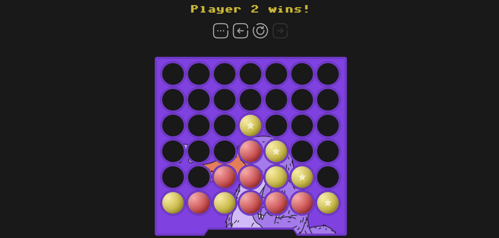
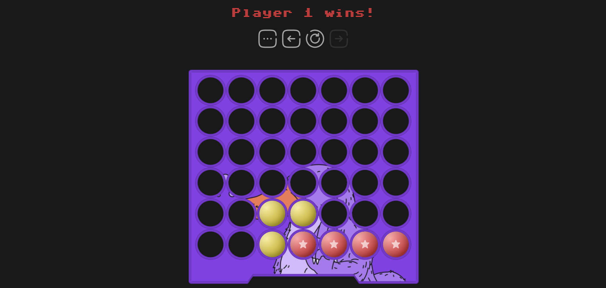
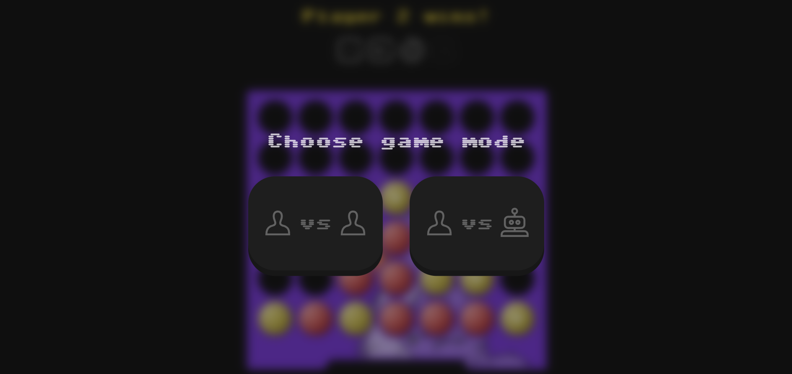

# Connect4

Логическая игра для одного или двух игроков \
https://connect4.shxbunin.ru

## Технологии

- React 19 + TypeScript
- Redux / Redux Toolkit
- Docker
- Git

## Локальный запуск

1. `cd /app`
2. `npm install`
3. `npm run build`
4. `npm run preview`

`Task 2 -> /app/src/lib/validator.ts`

## Функционал

- Undo/Redo
- Restart
- Выбор режима игры (1 на 1 или против бота)
- Подсветка победной комбинации
- Анимация падения фишки

## Сильные стороны проекта

- Удобный и красивый UI
- Адаптивная верстка
- Чистая архитектура
- Актуальный стек
- Деплой ([тык](https://connect4.shxbunin.ru))
- Возможность играть против бота

## Скриншоты

